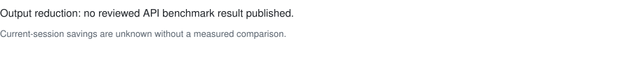

<p align="center">
  
</p>

<p align="center">
  <strong>why use many token when few do trick</strong>
</p>

<p align="center">
  You pay for AI by the token, and your agent writes like it knows that.<br>
  Caveman make agent stop. Same brain. Fewer words. Smaller bill.
</p>

<p align="center">
  <a href="https://www.producthunt.com/products/caveman?embed=true&amp;utm_source=badge-featured&amp;utm_medium=badge&amp;utm_campaign=badge-caveman-2" target="_blank" rel="noopener noreferrer"></a>
  <a href="https://trendshift.io/repositories/25391?utm_source=repository-badge&amp;utm_medium=badge&amp;utm_campaign=badge-repository-25391" target="_blank" rel="noopener noreferrer"></a>
</p>

<p align="center">
  <a href="https://github.com/JuliusBrussee/caveman/stargazers"></a>
  <a href="./INSTALL.md"></a>
  <a href="#wrap-any-agent"></a>
  <a href="#license"></a>
  <a href="https://skills.sh/JuliusBrussee/caveman"></a>
</p>

<p align="center">
  <a href="#see-it">See it</a> ·
  <a href="#install">Install</a> ·
  <a href="#what-you-save">Savings</a> ·
  <a href="#where-your-tokens-go">Learn</a> ·
  <a href="#caveman-proxy">Proxy</a> ·
  <a href="#wrap-any-agent">Wrap</a> ·
  <a href="./docs/README.md">Docs</a> ·
  <a href="#license">License</a>
</p>

---

## See it

<table>
<tr>
<th width="50%">🗣️ Normal agent — 69 tokens</th>
<th width="50%"> Caveman agent — 19 tokens</th>
</tr>
<tr>
<td valign="top">

> The reason your React component is re-rendering is likely because you're creating a new object reference on each render cycle. When you pass an inline object as a prop, React's shallow comparison sees it as a different object every time, which triggers a re-render. I'd recommend using useMemo to memoize the object.

</td>
<td valign="top">

> New object ref each render. Inline object prop = new ref = re-render. Wrap in `useMemo`.

</td>
</tr>
</table>

Nothing of value died in the second answer. The diagnosis survived, the fix survived, the `useMemo` survived; only the throat-clearing went. That's 50 tokens back on one reply, and an agent produces a few hundred replies a day.

Code, commands, file paths, and exact error messages never get cavemanned. Only the prose around them does.

## Install

Caveman comes in two sizes.

**The small one is the skill**: a rule file that makes your agent answer in caveman. Free forever, MIT, runs in [30+ agents](./INSTALL.md) (Claude Code, Codex, Gemini, Cursor, Windsurf, Cline, Copilot, more), installs in one command:

```bash
npx skills add JuliusBrussee/caveman
```

Type `/caveman` in your agent if it doesn't wake up on its own. That the whole install. One rock.

**The big one is the proxy.** It sits between your agent and the AI provider, on your machine, and shrinks what the agent *reads* before every call; a copy of anything it compressed stays on your disk in case the agent needs the original back. MIT CLI, BSL-1.1 runtime:

```bash
npm install -g @caveman-ai/cli && caveman setup --install
caveman claude        # or codex · gemini · aider · kilo · qwen · opencode · hermes · openclaw · pi
```

They stack. Most people start with the skill and graduate.

<details>
<summary><strong>More doors into the cave</strong> — full installer, Windows, single agents, uninstall</summary>

The full installer wires up Claude Code hooks and the statusline badge, detects every supported agent on your machine, and reruns safely (Node.js 22.13+):

```bash
curl -fsSL https://raw.githubusercontent.com/JuliusBrussee/caveman/v2.5.0/install.sh | bash
```

On Windows (PowerShell 5.1+):

```powershell
irm https://raw.githubusercontent.com/JuliusBrussee/caveman/v2.5.0/install.ps1 | iex
```

Just one agent:

```bash
# Claude Code
claude plugin marketplace add JuliusBrussee/caveman && claude plugin install caveman@caveman

# Gemini CLI
gemini extensions install https://github.com/JuliusBrussee/caveman

# Qwen Code CLI, then its Caveman wrapper
npm i -g @qwen-code/qwen-code
caveman qwen

# Codex, Cursor, Windsurf, Cline, and other skills-compatible agents
npx skills add JuliusBrussee/caveman --skill '*' -a codex --yes  # replace codex with your agent profile
```

Changed your mind: `npx -y github:JuliusBrussee/caveman -- --uninstall`.

</details>

The full 30+ agent matrix, dry runs, flags, and verification live in [INSTALL.md](./INSTALL.md).

## What you save

Quick vocabulary, since tokens are the whole point: a token is the unit AI billing runs on, roughly three-quarters of a word. Your agent spends them twice, once on everything it writes and again on everything it reads, and the reading is usually the bigger half of the bill. Caveman goes after both.

### Writing less

Ten ordinary coding prompts through the real Claude API, with the skill and without. Same model, same questions; the only change is caveman telling it to keep it short:



<details>
<summary><strong>The numbers behind the chart</strong> — regenerate with <code>uv run python benchmarks/run.py</code></summary>

<!-- BENCHMARK-TABLE-START -->
| Task                                    | Normal   | Caveman | Saved   |
| --------------------------------------- | -------- | ------- | ------- |
| Explain React re-render bug             | 1180     | 159     | 87%     |
| Fix auth middleware token expiry        | 704      | 121     | 83%     |
| Set up PostgreSQL connection pool       | 2347     | 380     | 84%     |
| Explain git rebase vs merge             | 702      | 292     | 58%     |
| Refactor callback to async/await        | 387      | 301     | 22%     |
| Architecture: microservices vs monolith | 446      | 310     | 30%     |
| Review PR for security issues           | 678      | 398     | 41%     |
| Docker multi-stage build                | 1042     | 290     | 72%     |
| Debug PostgreSQL race condition         | 1200     | 232     | 81%     |
| Implement React error boundary          | 3454     | 456     | 87%     |
| **Average**                             | **1214** | **294** | **65%** |
<!-- BENCHMARK-TABLE-END -->

</details>

> [!IMPORTANT]
> Before you multiply 65% by your invoice: the skill only shortens **output**. Input and reasoning tokens don't change, and the skill's own rules cost about 1–1.5k input tokens every turn, so whole-session savings land lower than the chart, and on workloads that were already terse you can lose money. Speed and readability are the real product; the discount is the bonus. The full accounting, including the cases where caveman loses, is in [docs/HONEST-NUMBERS.md](./docs/HONEST-NUMBERS.md).

### Reading less

An agent rereads logs, test output, diffs, and half your repo all day long, which is why input dwarfs output on most invoices. The proxy compresses that stream. In a pinned 54-run Claude Code benchmark it used **33.2% fewer provider-reported input tokens** than direct Claude Code and passed all 18/18 exact-answer checks, so the squeeze cost nothing in correctness:


One case got *worse*, and it's on the chart: HTML had no compression transform, so caveman paid its own overhead and won nothing back. Losses stay visible here. Method, confidence intervals, and limits: [docs/WRAP-BENCHMARK.md](./docs/WRAP-BENCHMARK.md) `benchmark_counterfactual`

Browsing gets the same treatment. A focused question against a 200-row operations table costs **121 tokens** through caveman's compressed view of the page; the Playwright ARIA baseline spends 15,704 on the same answer, which makes caveman **129.8× smaller** there ([`browse/BENCHMARK.md`](./browse/BENCHMARK.md)).

## Where your tokens go

You don't have to guess whether any of this applies to you. Months of your agent history already sit on your disk, and `caveman learn` will read it: local, read-only, no account.

```bash
caveman learn             # Claude Code + Codex + Gemini CLI + opencode; aider via CAVEMAN_AIDER_ROOT
```

<p align="center">
  
</p>

Out comes a Cave Score, your token sinks ranked worst-first with a one-line fix behind each, how deep each session ran into its context window, a replay of what the fixes would have saved you, and a list-price estimate of what those sinks cost over 30 days.

Ready to act on it?

```bash
caveman learn implement   # hand the plan to Claude Code or Codex
```

That opens your own agent with the plan and one rule it must follow: propose each fix as a diff, apply only on your yes, re-measure, and revert anything that didn't lower tokens per turn. Caveman never makes your agent dumber to make it cheaper.

## Caveman Proxy

The proxy is one local process. Your agent talks to it, it talks to your provider, and nothing about your account changes; Claude Pro/Max OAuth credentials pass through to Anthropic untouched. There is no Caveman backend in the path. Originals of everything it compresses live in a SQLite file on your machine, each with a recovery handle, so the agent can always pull back what caveman squeezed.

```bash
caveman claude             # or any of the ten wrapped agents
```

<p align="center">
  
</p>

<details>
<summary><strong>What the engine keeps, by payload type</strong> — and the wrap stack diagram</summary>

<p align="center">
  
</p>

`detect()` types each payload and routes it to a compressor that keeps what answers depend on:

| Detected type   | Keeps                                                                  | Target savings |
| --------------- | ---------------------------------------------------------------------- | -------------- |
| `json`          | keys, structure, error/message subtrees; collapses repetitive arrays   | 70–90%         |
| `log`           | errors, stack traces, first/last lines; drops INFO and progress noise  | 85–95%         |
| `code`          | imports, signatures, types; elides function bodies, syntax stays valid | 40–70%         |
| `diff`          | file/hunk headers and changed lines; elides repeated context           | 60–80%         |
| `search-result` | top/bottom hits plus diagnostic/security hits                          | 80–95%         |
| `text` / HTML   | headings, opening/closing context, important sections                  | 50–80%         |

`contextwindow.Pack()` additionally fits candidate context into a token budget by BM25 relevance, recency, and error signal, returned in original order so chronology survives.

</details>

The same engine answers to a set of verbs:

```bash
caveman learn                   # scan your real agent history → score + ranked token sinks
caveman learn implement         # fix the findings with your own agent, consent-gated per edit
caveman explore install         # read-only FastContext subagent: finds code as path:line
caveman shrink -- pnpm test     # compress noisy command output, byte-exact recoverable
caveman browse <url>            # local Chrome over a compressed a11y tree
caveman mem remember|recall     # durable memory; `mem recover <handle>` = original bytes
caveman trial -- claude         # A/B a real session, then `trial report`
caveman toon encode|decode      # the TOON re-encoder, standalone
caveman stats                   # what caveman actually did, by content type
```

Any MCP host gets the same powers through five tools: `caveman_compress`, `caveman_retrieve`, `caveman_stats`, `caveman_toon_encode`, `caveman_toon_decode`.

## Pixel mode

Caveman eating its own tail. Every skill you install, this one included, is prompt text your agent reloads on every single invocation, and you pay that tax forever. `caveman convert` renders an installed skill's body to PNG pages in place; the frontmatter stays text so discovery and triggering keep working, and the model reads the body as an image.

```bash
caveman convert --dry-run        # every installed skill, with the token math, no writes
caveman convert --agent claude   # convert the profitable ones
caveman convert --revert         # byte-identical restore from SKILL.orig.md
```

On the caveman skill itself that's **1,069 → 415 estimated tokens, a 61% cut**. Convert only fires when pages beat the text; any failure leaves the skill byte-identical and names the gate that said no. New skills installed through `caveman skills install` get pixeled by default (`--no-pixel` opts out).

## The skill, fully unpacked

The talking style is the headline, but one skill install carries a toolbox. Switch intensity anytime with `/caveman lite|full|ultra|wenyan-lite|wenyan-full|wenyan-ultra`; go back to normal with `/caveman off` or by saying `normal mode`.

<details>
<summary><strong>Everything in the box</strong> — commit messages, reviews, subagents, work patterns</summary>

| Tool / command                                                                                                                                  | What you get                                                                                                                |
| ----------------------------------------------------------------------------------------------------------------------------------------------- | --------------------------------------------------------------------------------------------------------------------------- |
| `/caveman [lite\|full\|ultra\|wenyan-lite\|wenyan-full\|wenyan-ultra\|off]`                                                                           | Shorter replies at the intensity you choose.                                                                                |
| `cavecrew-investigator`, `cavecrew-builder`, `cavecrew-reviewer`                                                                                | Compressed subagent presets for locating, editing, and reviewing code.                                                      |
| `/caveman-commit`                                                                                                                               | Terse Conventional Commit messages.                                                                                         |
| `/caveman-review`                                                                                                                               | One-line, actionable review findings.                                                                                       |
| `/caveman-compress <file>`                                                                                                                      | Smaller Markdown memory files, with the original backed up.                                                                 |
| `/caveman-stats`                                                                                                                                | Local session token usage and estimated savings in Claude Code.                                                             |
| `/caveman-help`                                                                                                                                 | One-screen reminder of every mode and command.                                                                              |
| `investigate-first`, `lean-build`, `surgical-patch`, `safe-refactor`, `migration`, `verify-and-stop`                                            | Work patterns that write less code, so the agent bills fewer tokens. Your agent picks these up on its own when a task fits. |
| `/caveman-setup`, `/caveman-discover`, `/caveman-learn`, `/caveman-manage`, `/caveman-optimize`, `/caveman-explore`, `/caveman-evidence-review` | Drive the caveman engine and proxy: set it up, find where tokens go, act on what it finds.                                  |

</details>

## Wrap any agent

Ten agents wrap natively. `caveman <agent>` switches the native integration on for good and launches the agent; `caveman wrap <agent>` runs one session and leaves nothing behind. Adding an agent is normally one JSON profile in [`agents/profiles/`](./agents/profiles/), no code.

| Agent                | Vendor           | How it's wrapped                                             |
| -------------------- | ---------------- | ------------------------------------------------------------ |
| **Claude Code**      | Anthropic        | env vars                                                     |
| **OpenAI Codex CLI** | OpenAI           | env vars (API key) · ephemeral `CODEX_HOME` (ChatGPT login)  |
| **Gemini CLI**       | Google           | env vars                                                     |
| **Aider**            | OpenAI/Anthropic | env vars                                                     |
| **Kilo Code**        | Kilo Code        | `KILO_CONFIG_CONTENT`, your `kilo.json` untouched            |
| **Qwen Code**        | QwenLM           | ephemeral system-settings overlay, source settings untouched |
| **opencode**         | sst              | inline config via env, your `opencode.json` untouched        |
| **Hermes Agent**     | Nous Research    | `--provider custom` + env                                    |
| **OpenClaw**         | OpenClaw         | ephemeral merged config, your config read-only               |
| **Pi**               | pi.dev           | bundled native extension, your `~/.pi` config untouched      |

<details>
<summary><strong>Per-agent fine print</strong> — what gets written, smoke tests, the default loadout, SDK recipes</summary>

`caveman wrap` never edits your config files. The persistent shortcut's writes are journaled and reversible with `caveman disable <agent>`. Real sessions round-trip in record mode, tested against **Hermes v0.18.0**, **OpenClaw 2026.6.11**, and **Pi 0.84.2**.

Kilo Code **7.5.6** passed a pinned real-CLI route and streaming-response smoke; its profile also runs through the same real-proxy compression and telemetry matrix as every other agent. This wraps Kilo's CLI (`kilo` or `kilocode`), not an already-running editor extension.

Qwen Code **0.22.3** passed pinned real-CLI local and managed OpenAI-compatible route smokes. Caveman deep-merges its route into a temporary system-settings overlay, preserves enterprise platform defaults, and leaves the source system and user settings unchanged. Install agent-side recovery with `caveman tools mcp install qwen --server caveman`; remove only Caveman's owned entry with the matching `uninstall` command.

The default wrap hands the agent the whole loadout: the five caveman MCP tools, the browse MCP server when Chrome resolves, command-output shrink through a real hook on Claude, opencode, Gemini, Hermes, and OpenClaw (Codex gets an honest soft note, its runtime rejects the rewrite: [openai/codex#18491](https://github.com/openai/codex/issues/18491)), and [pixel mode](#pixel-mode) on new skill installs. Turn pieces off in `~/.caveman-cloud/config.json`.

Agent not on the list? Point any provider SDK or framework (Vercel AI SDK, LangChain, LiteLLM, OpenAI Agents, CrewAI, PydanticAI) at the local proxy with a `baseURL` swap: [`integrations/recipes/`](./integrations/recipes/).

</details>

## The whole cave

One idea everywhere: **agent do more with less.**

| Repo                                                                  | What it shrinks                                          | Status            |
| --------------------------------------------------------------------- | -------------------------------------------------------- | ----------------- |
| **[caveman](https://github.com/JuliusBrussee/caveman)** *(you here)*  | What the agent **says**, and now what it **reads**       | live              |
| **[caveman-browse](https://github.com/JuliusBrussee/caveman-browse)** | What the agent **sees in the browser**                   | live              |
| **caveman-agent-sdk**                                                 | What your production agent **loads, calls, and spends**  | own repo · in dev |
| **[cavegemma](https://github.com/JuliusBrussee/cavegemma)**           | The compression **baked into weights** (Gemma fine-tune) | labs              |
| **[caveman-code](https://github.com/JuliusBrussee/caveman-code)**     | The **whole agent**, end to end                          | frozen            |
| **[cavemem](https://github.com/JuliusBrussee/cavemem)**               | What the agent **remembers**, across sessions            | frozen            |
| **[cavekit](https://github.com/JuliusBrussee/cavekit)**               | The **build loop**, spec-driven                          | frozen            |

The frozen ones still install and still work; development just moved on, and their best ideas came along. cavemem's compressed-memory core now ships inside caveman, and caveman-code taught us to make the agent you already use cheaper instead of asking you to switch agents.

**Caveman make token small. Caveman Cloud make it *provable*.**

Numbers caveman computes locally are labeled `inferred`. Pinned benchmarks are `benchmark_counterfactual`. Neither one is a provider invoice, and offline caveman will never call itself `verified`. Caveman Cloud is where live evidence can earn that word: baseline in record mode, changes behind eval gates, rollback on quality loss, savings measured from real traffic with signed receipts.

**[Join the waitlist → caveman.so](https://caveman.so)**

## Privacy

Your agent still talks to the provider you chose, and local compression needs no Caveman account. The `caveman` CLI sends anonymous usage stats by default: which commands ran, plus token counts through and cut. Never your prompts, code, or file paths. It says so on first run, and one command turns it off forever: `caveman telemetry off` (or `DO_NOT_TRACK=1`). Skill and hooks run locally; the proxy forwards provider traffic; CCR stays in a SQLite file on your disk. Exact network, telemetry, and storage boundaries: [SECURITY.md](./SECURITY.md).

## License

Split license. Skill and adoption surfaces are [MIT](./LICENSE). Engine-linked runtime is BSL-1.1 source-available, not OSI Open Source before Change Date.

**MIT** — the skill, Agent SDK and initializer, the CLI, both client SDKs (TS + Python), contracts, provider catalog, the extension shell, and the thin cavemem clients.

**BSL-1.1** — Engine, Proxy, Cache Engine, rewriter, Browse, MCP server, `shrink`, cavemem Go core, and shared Go platform. New Engine-linked runtime modules default to BSL-1.1. Source-available: read it, fork it, self-host it for your own first-party traffic free, production included. Every BSL version auto-converts to **Apache-2.0** on the earlier of `2030-06-21` or four years after that version first ships. Third-party hosted, managed, or embedded service use needs commercial license. BSL text and per-directory map ship with source.

`engine/pixel` embeds [pxpipe](https://github.com/teamchong/pxpipe) (MIT) plus glyph atlases derived from Spleen 5×8 (BSD-2-Clause) and GNU Unifont (dual OFL-1.1 / GPLv2-with-font-exception); its `NOTICE` travels with that source.

"Caveman" and the rock logo are trademarks of Julius Brussee. "Powered by Caveman" is fine when true.

## Star this repo

Caveman save you token, save you money. Star cost zero. Fair trade. ⭐

[](https://star-history.com/#JuliusBrussee/caveman&Date)

---

<sub>
<strong>Docs:</strong>
<a href="./docs/README.md">Technical manual</a> ·
<a href="./INSTALL.md">Install matrix</a> ·
<a href="./docs/HONEST-NUMBERS.md">Honest numbers</a> ·
<a href="./docs/WRAP-BENCHMARK.md">Wrap benchmark</a> ·
<a href="./LICENSE">License</a> ·
<a href="./CONTRIBUTING.md">Contributing</a> ·
<a href="./CLAUDE.md">Maintainer guide</a> ·
<a href="https://github.com/JuliusBrussee/caveman/issues">Issues</a>
<br>
MIT skill · BSL-1.1 engine — few token. no lie.
</sub>