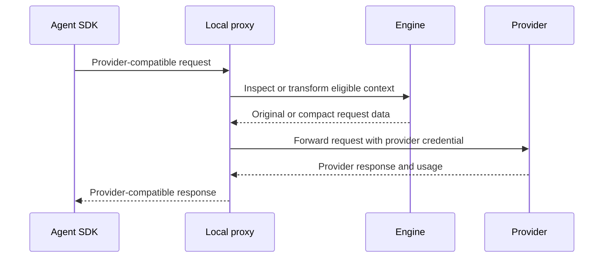

# Local proxy and providers

Local proxy presents provider-compatible HTTP routes on loopback, applies
configured local transforms, forwards requests to provider endpoints, and
records local usage. It is a single-operator developer tool, not a multi-user
network gateway.

Start it with:

```bash
caveman start
```

Default address is `127.0.0.1:8787`.

## Request path



Provider credentials are preserved from inbound requests. Supported environment
fallbacks apply only when an integration does not send a credential.

## Routes

### Anthropic

```text
/anthropic/v1/messages
/anthropic/v1/messages/count_tokens
/v1/messages
```

### OpenAI

```text
/openai/v1/chat/completions
/openai/v1/responses
/openai/v1/embeddings
/v1/chat/completions
/v1/responses
/v1/embeddings
```

### Google Gemini

```text
/gemini/v1beta/models/{model}:generateContent
/gemini/v1beta/models/{model}:streamGenerateContent
/gemini/v1beta/models/{model}:countTokens
```

Equivalent bare Gemini paths are also accepted where profile configuration uses
them.

### Amazon Bedrock

```text
/bedrock/model/{model}/invoke
/bedrock/model/{model}/invoke-with-response-stream
/bedrock/model/{model}/converse
/bedrock/model/{model}/converse-stream
```

Optional Mantle compatibility route:

```text
/bedrock/anthropic/v1/messages
```

### Azure OpenAI and Vertex AI

Azure mounts under `/azure/...` after its base URL is configured. Vertex mounts
under `/vertex/v1/projects/...` and supports public Google and Anthropic
publisher route forms implemented by adapter. Both are opt-in because endpoint
and identity configuration are installation-specific.

### OpenAI-compatible providers

Named compatibility mounts use:

```text
/compat/{name}/...
```

Each mount declares `base_url` and an environment-variable name containing its
credential. Compatibility means HTTP shape, not guaranteed support for every
provider extension.

One mount is built in. The proxy registers `/compat/opencode-go/` with the
upstream `https://opencode.ai/zen/go` and the credential variable
`OPENCODE_API_KEY`. A `compat` entry with the name `opencode-go` in
`caveman.yaml` replaces the built-in mount and can set another endpoint.

The Pi extension routes a provider through `/compat/<name>/` only when the
running proxy publishes a compat mount whose name is exactly the provider name
and whose `base_url` host and port match the provider's base URL. The proxy
publishes its mounts in the run-state file it writes on start, so the extension
can verify a mount instead of guessing one; a provider with no matching mount
stays direct with a notice. The mount's `base_url` path is what the proxy
forwards to: a provider on the same host but a different path is sent to the
mount's path, not its own. A mount pointing at a loopback relay (litellm,
ollama, llama.cpp) also needs a `CAVE_SSRF_ALLOWLIST` entry; see
[Security and privacy](security-and-privacy.md).

```yaml
compat:
  myprovider:
    base_url: http://127.0.0.1:4000
    api_key_env: MYPROVIDER_API_KEY
```

A named mount can serve two wire protocols from one upstream. The credential
header follows the request path. A request to `/compat/{name}/v1/messages`
(Anthropic protocol) carries the key in `x-api-key`. Every other path carries
the key in `Authorization: Bearer`. A real inbound Bearer token keeps its header
on every path. OpenCode Go rejects a Bearer header on its Anthropic path, so
this rule is necessary for the `anthropic-messages` models.

## Modes

| Mode | Request behavior |
|---|---|
| `record` | Forward model-visible bytes unchanged |
| `compress` | Apply eligible Engine transforms with recovery |
| `pixel` | Allow configured text-to-image context transport |
| `recommend` | Produce local recommendations without active transform |
| `shadow` | Evaluate eligible changes without serving them |
| `canary` | Apply configured experimental behavior to selected traffic |
| `active` | Apply enabled optimizer behavior |

Unknown mode becomes `record`. Standard local CLI workflows expose record,
compress, and pixel; other modes support controlled evaluation paths.

## Streaming

Proxy preserves provider streaming protocols and status behavior. Request
transforms finish before upstream dispatch; streaming response stays streaming.

## Credentials

API keys stay outside YAML. Anthropic, OpenAI, Gemini, and Azure use their named
environment variables; Bedrock uses supported AWS or bearer-token identity paths.

Never log authorization headers. Local telemetry should store usage and bounded
metadata, not raw secrets.

## Endpoint security

Proxy rejects non-loopback listen addresses. Outbound Server-Side Request
Forgery protection checks configured endpoints and redirects. Private,
link-local, and loopback upstreams are blocked unless explicitly included in
`CAVE_SSRF_ALLOWLIST` for a self-hosted setup.

See [Security and privacy](security-and-privacy.md) before allowing a local
model endpoint.

## Pricing and usage

Provider catalog supplies dated public list prices. Unknown provider or model
prices resolve to zero with an `unpriced` marker rather than a guessed cost.
Provider-reported token counts remain distinct from Engine estimates.

Displayed provider cost is a list-price subtotal, not a provider invoice. See
[Accounting and evidence](accounting-and-evidence.md).

## Troubleshooting

- A `404` often means agent uses wrong provider mount or bare route.
- Authentication failures should be checked at inbound header and provider
  credential source without printing secret values.
- A blocked custom base URL usually needs a precise `CAVE_SSRF_ALLOWLIST` entry.
- Unexpected unchanged context is valid when mode is record or a transform
  fails parse, size, policy, or recovery gates.
- For behavior comparison, repeat request in record mode and compare provider
  request and response classes, not secret-bearing raw logs.
